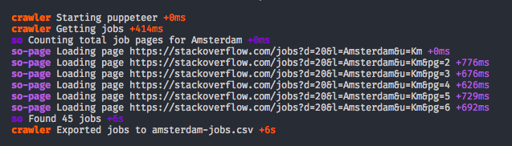

# Stack Overflow Jobs Scraper

A small CLI which allows you to download all jobs in a given location that contain salary information.

Usage:

```bash
npm run jobs -- -l Amsterdam -f amsterdam-jobs.csv
```

Screenshot:


